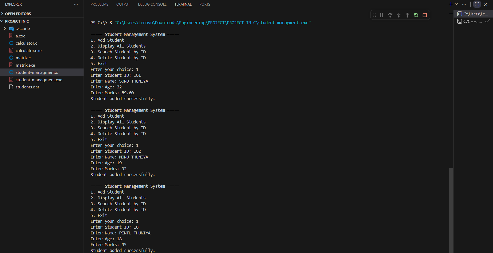
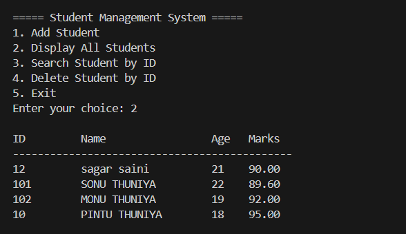
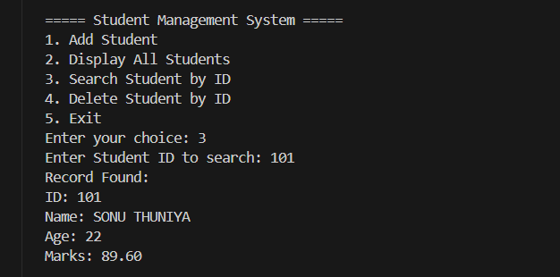
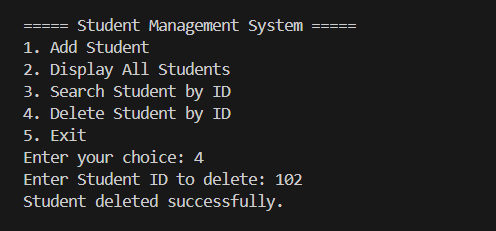

# 📚 Student Management System in C

A simple **menu-driven Student Management System** implemented in C using **file handling**.  
This program allows users to **add, display, search, and delete student records** stored in a binary file (`students.dat`).

---

## ✨ Features
- ➕ **Add Student**: Enter student details (ID, Name, Age, Marks) with validation.
- 📋 **Display Students**: View all stored student records in a tabular format.
- 🔍 **Search Student**: Find a student by their unique ID.
- ❌ **Delete Student**: Remove a student record by ID.
- ✅ **Validation**: Ensures proper input (e.g., names only contain letters/spaces, marks between 0–100).

---

## 🛠️ Technologies Used
- **Language**: C
- **Concepts**: File Handling, Structures, Input Validation, Menu-driven Programming

---

## 📂 File Structure
├── students.dat        # Binary file storing student records

├── main.c              # Source code (Student Management System)

└── README.md           # Documentation

---


---

## 🚀 How to Run
1. **Clone or download** the project.
2. Compile the program using GCC:
   ```bash
   gcc main.c -o student-managment

3. Run the executable:
     ```bash
     ./student-managment

  ---

  ===== Student Management System =====
1. Add Student
2. Display All Students
3. Search Student by ID
4. Delete Student by ID
5. Exit
Enter your choice: 1

Enter Student ID: 101

Enter Name: SONU THUNIYA

Enter Age: 20

Enter Marks: 89.60

Student added successfully.

---

## 📸 Sample Output

### Add Student


### Display Students


### Search Student


### Delete Student



---

## 🧩 Functions Overview

| Function Name      | Purpose                                                                 |
|--------------------|-------------------------------------------------------------------------|
| `addStudent()`     | Adds a new student record to `students.dat` with validation checks.     |
| `displayStudents()`| Displays all student records in a tabular format.                       |
| `searchStudent()`  | Searches for a student by their unique ID and shows details if found.   |
| `deleteStudent()`  | Deletes a student record by ID using a temporary file replacement.      |
| `isValidName()`    | Validates that the entered name contains only letters and spaces.       |

 ---

## ⚡ Improvements (Future Scope)
 Update student details (edit functionality).

Sort students by marks or age.

Export records to a text/CSV file.

Add password protection for admin access.

---

*👨‍💻 Author: Sonu Thuniya*

📅 Internship Task – C PROGRAMMING 


---
## 🙏 Acknowledgement

I would like to express my sincere gratitude to **Code Alpha** for providing me with the valuable opportunity to pursue an internship in **C Programming**.  

This internship has been a significant milestone in my learning journey, allowing me to:
- Strengthen my understanding of **file handling, structures, and modular programming** in C.
- Gain practical experience by working on real-world projects such as the **Student Management System**.
- Enhance my problem-solving skills and improve my ability to write clean, efficient, and well-documented code.

I am truly thankful to the mentors and the entire team at Code Alpha for their guidance, support, and encouragement throughout this internship. Their platform has helped me bridge the gap between academic knowledge and practical application, and I look forward to applying these skills in future projects and professional endeavors.

---

